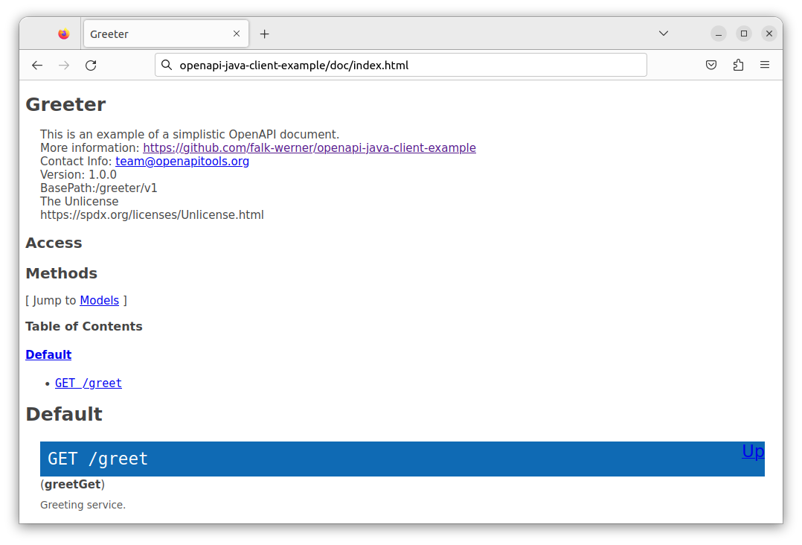

# openapi-java-client-example

This repository contains an example how to create an [OpenAPI](https://www.openapis.org/) client in Java using [OpenAPI generator](https://openapi-generator.tech/).

## Overview

This document works as tutorial how to create an OpenAPI client in Java based on a very simplistic API specification. It shows, how to

- verify an OpenAPI specification document
- generate an HTML documentation
- generate a python-based server stub for testing purposes
- generate a java client
- use the generated java client

All generated code is contained in this repository.

## Requirements

To follow this tutorial, you need to install some packages:

- Java JDK 11 (openjdk-11-jdk)
- Gradle
- Python 3

## Download OpenAPI Generator CLI

There are several ways how to install OpenAPI Generator CLI described on their [homepage](https://openapi-generator.tech/docs/installation).

Since this is a java-centered turorial, I downloaded the latest version from [maven central](https://central.sonatype.com/artifact/org.openapitools/openapi-generator-cli/6.6.0/versions). All furher steps assume, that the `jar` version of the generator is used. I've also stripped the version from the downloaded `jar`.

To perform the download, the script [get-openapi-generator-cli.sh](script/get-openapi-generator-cli.sh) can be used:

```bash
> ./script/get-openapi-generator-cli.sh
```

Once downloaded, the generator can be invoked via `jave -jar` command:

```bash
> java -jar openapi-generator-cli.jar version
```

This should print the version number of OpenAPI Generator CLI.

## The API specification

This tutorial uses a very simplistic API to focus on the generator stuff and
to keep things simple. OpenAPI supports API specification in YAML and JSON format.

The [openapi](openapi) directory of this repository contains an API specification
the the `greeter` service in both formats.

- [greeter_v1.yml](openapi/greeter_v1.yml)
- [greeter_v1.json](openapi/greeter_v1.json)

Both files are sematically equivalent. In this tutorial, the YAML version is used,
but all commands can also applied to the JSON version and will result in the same
output.

The `greeting service` exports only one path: `greet`. The greeting can be obtained
using HTTP get. The optional argument `whom` can be specified to obtain a
personalized greeting.

Assuming a server running the greeting service is available at `http://localhost:8080`,
a greeting can be obtained via `curl`:

```bash
> curl http://localhost:8080/greeter/v1/greet?whom=Bob
Hello, Bob!
```

## Validate OpenAPI Documents

Before generating server and client code, the API specification document should be
validated to detect errors early.

Validation can be done via OpenAPI Generator CLI:

```bash
> java -jar openapi-generator-cli.jar validate -i openapi/greeter_v1.yml 
Validating spec (openapi/greeter_v1.yml)
No validation issues detected.
```

## Generate API documentation



OpenAPI Generator CLI an be used to generate a HTML documentation
based on the API specification. The following command creates an
[doc/index.html](doc/index.html) which can be viewed in a web browser.

```bash
> java -jar openapi-generator-cli.jar generate -g html \
  -i openapi/greeter_v1.yml \
  -o doc
```

## Generate Server for testing

OpenAPI Generator CLI can be used to generate a server for testing purposes.
There is a vast variety of programming languages and frameworks supported by the generator. To keep things simple, the `python-flask` generator is used in the tutorial.

The following command can be used to generate the server code:

```bash
> java -jar openapi-generator-cli.jar generate -g python-flask \
  -i openapi/greeter_v1.yml \
  -o test-server
```

This generates the code of the service in the `test-server` directory.

Before the server can be started, some Python requirements need to be installed:

```bash
> cd test-server
> pip3 install -r requirements.txt
```

Now the test server can be started:

```bash
> python3 -m openapi_server
```

The server can be tested via the `curl` command provided above:

```
> curl http://localhost:8080/greeter/v1/greet?whom=Bob
do some magic!
```

As you might notices, the server's reply is not quite what we wanted. Instead of the expected greeting `Hello, Bob!`, a generic placeholder `do some magic!` is returned.

This is because the generator does only generate a server stub. We have to provide some same implementation. Thefore, we have to implement the
`greet_get` function located in the [default_controller.py](test-server/openapi_server/controllers/default_controller.py) file.

```Python
def greet_get(whom="you"):  # noqa: E501
    """greet_get

    Greeting service. # noqa: E501

    :param whom: Contains the name to greet.
    :type whom: str

    :rtype: Union[str, Tuple[str, int], Tuple[str, int, Dict[str, str]]
    """
    return f'Hello, {whom}!'
```

After the server is restarted, re-running the `curl` command will result
in the expected results:

```
> curl http://localhost:8080/greeter/v1/greet?whom=Bob
Hello, Bob!

> curl http://localhost:8080/greeter/v1/greet
Hello, you!
```

### Running in Browser


Since our greeting service is available via HTTP get, it can also be used
via your favorite web browser. Just start the browser and navigate to
[http://localhost:8080/greeter/v1/greet?whom=Alice](http://localhost:8080/greeter/v1/greet?whom=Alice).

### Swagger UI


The generated server sub also provides [Swagger UI](https://swagger.io/tools/swagger-ui/) to explore and test the API on the running web server. This can be very useful for more complex APIs.

To open Swagger UI, start your favorite web browser and navigate to [http://localhost:8080/greeter/v1/ui/](http://localhost:8080/greeter/v1/ui/)

## Java Client

Open API Generator can be used to generate OpenAPI clients based on a provided API specification file. When using the `java` generator some
extra options can be specfied. A full list of the specific options
of the `java` generator can be found [here](https://openapi-generator.tech/docs/generators/java).

At least the Java package should be specifed as shown below:

```bash
> java -jar openapi-generator-cli.jar generate -g java \
    -i openapi/greeter_v1.yml \
    -o java-client \
    -p apiPackage=org.example.greeter
```

This command generates a Java client for the `greeter service` in the
[java-cient](java-client) directory. Since they were some files generated which are not in use for this tutorial, I removed those files:
- .github directory containing a default build workflow
- pom.xml file used for maven integration
- Android support in `build.gradle`

The generator also creates some test which can be executed using gradle:

```bash
> ./gradlew test
Starting a Gradle Daemon (subsequent builds will be faster)

> Task :test

DefaultApiTest > greetGetTest() SKIPPED

BUILD SUCCESSFUL in 5s
4 actionable tasks: 3 executed, 1 up-to-date
```

For some reason, the only test existing is disabled.

### Enable test

To enable the test, wich will run again the previously created
test server, we have to change [DefaultApiTest.java](/home/user/src/openapi-java-client-example/java-client/src/test/java/org/example/greeter/DefaultApiTest.java).

```Java
package org.example.greeter;

import static org.junit.jupiter.api.Assertions.assertEquals;

import org.example.ApiClient;
import org.example.ApiException;
import org.junit.jupiter.api.Disabled;
import org.junit.jupiter.api.Test;

import java.util.ArrayList;
import java.util.Arrays;
import java.util.HashMap;
import java.util.List;
import java.util.Map;

/**
 * API tests for DefaultApi
 */
public class DefaultApiTest {

    private final DefaultApi api = new DefaultApi();

    /**
     * Greeting service.
     *
     * @throws ApiException if the Api call fails
     */
    @Test
    public void greetGetTest() throws ApiException {
        ApiClient client = new ApiClient();
        HashMap<String,String> variables = new HashMap<>();
        variables.put("host", "http://localhost:8080");
        client.setServerVariables(variables);

        DefaultApi greeter = new DefaultApi(client);
        
        String whom = "Bob";
        String response = api.greetGet(whom);

        assertEquals("Hello, Bob!", response);
    }

}
```

With this changes applied, the tests can be executed sucessfully:  
_(Make sure, the test server is still running.)_

```bash
> ./gradlew test

> Task :test

DefaultApiTest > greetGetTest() PASSED

BUILD SUCCESSFUL in 1s
4 actionable tasks: 2 executed, 2 up-to-date
```


## References

- [OpenAPI](https://www.openapis.org/)
- [OpenAPI Generator](https://openapi-generator.tech/)
- [Swagger UI](https://swagger.io/tools/swagger-ui/)
